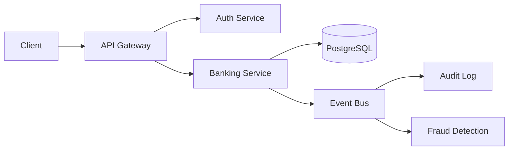

# SecureBank 360


[](https://github.com/Raphasha27/securebank-360/actions)
[](https://github.com/koketseraphasha/securebank-360/actions/workflows/ci.yml)

**Enterprise digital banking platform with AI-powered security.**  
Combines Java/Spring Boot banking systems with cybersecurity and AI — the ultimate banking portfolio project.

## Modules

| Module | Description |
|--------|-------------|
| Customer Management | Registration, KYC, risk profiling |
| Account Management | Savings, Current accounts |
| Transactions | Transfers, deposits, withdrawals |
| Fraud Detection | Rule-based + AI anomaly detection |
| Loan Processing | Applications, approvals, repayments |
| Audit Logging | Full transaction and access audit trail |
| Security | MFA, JWT, RBAC, session management |
| AI Assistant | OpenAI-powered insights and reporting |


## Architecture



Microservices-based architecture with API Gateway, authentication layer, PostgreSQL persistence, and event-driven communication.

## Tech Stack

- **Backend:** Java 21, Spring Boot 3.4, Spring Security, Spring Data JPA
- **Database:** PostgreSQL 16
- **Security:** JWT, MFA, RBAC
- **Infrastructure:** Docker, GitHub Actions (CI + CodeQL)
- **AI:** OpenAI API (integration ready)

## Quick Start

```bash
docker compose up -d
# App runs at http://localhost:8080
# Health check: http://localhost:8080/api/v1/health
```

## API Endpoints

| Method | Path | Description |
|--------|------|-------------|
| GET | /api/v1/health | Health check |
| POST | /api/v1/customers | Create customer |
| POST | /api/v1/accounts | Open account |
| POST | /api/v1/transactions/transfer | Transfer funds |
| GET | /api/v1/accounts/{id}/transactions | Transaction history |
| GET | /api/v1/fraud-alerts | List fraud alerts |

## Security

Banking-grade security designed for defensive financial technology. See [SECURITY.md](SECURITY.md).

## Author

**Koketso Raphasha** — Full-Stack Developer, AI Engineer, Cybersecurity Enthusiast

## Deployment & Architecture

This project is designed with cloud-ready principles:

- **Containerized** using Docker for consistent deployment
- **Environment-based configuration** — no hardcoded secrets
- **Modular structure** for independent scaling
- **Stateless design** where applicable
- **Separation of concerns** for maintainability

### Run Locally

`ash
docker-compose up --build
`

---

*Part of the Kirov Dynamics Technology portfolio — backend engineering focused on security, scalability, and system design.*
